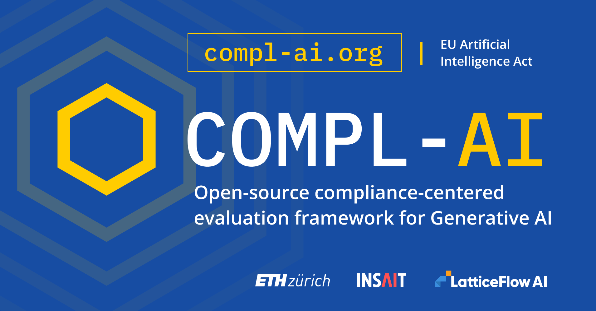

<div>
  <p>
    <a href="https://compl-ai.org" target="_blank">
      </a>
  </p>
</div>


This repository contains the open-source framework and the corresponding technical mapping for evaluating generative AI models.
- To run the evaluation yourself, please follow the instructions below.
- To request an evaluation, please contact us through the [compl-ai.org](https://compl-ai.org) website. 

This project created by [ETH Zurich](https://www.sri.inf.ethz.ch/), [INSAIT](https://insait.ai/) and [LatticeFlow AI](https://latticeflow.ai/).

## Installation

### 1. Clone this repository
```console
git clone https://github.com/compl-ai/compl-ai.git
```
### 2a. Using `uv run`

You can run the CLI directly using:

```console
uv run complai --help
```

### 2b. Manual Installation

You can also create a virtual environment and install the package manually. Using `uv`:

```console
uv venv
source .venv/bin/activate
uv pip install .
```
Now you can use the CLI like so:

```console
complai --help
```

## Quickstart

```console
# OpenAI
export OPENAI_API_KEY=your-openai-api-key
uv run complai eval -m openai/gpt-5-mini-2025-08-07 --limit 5

# Local (Starts a vLLM server)
uv run complai eval -m vllm/HuggingFaceTB/SmolLM2-135M-Instruct --limit 5 

# Check results in ./logs/ or run
uv run inspect view
```


## CLI


```console
$ complai [OPTIONS] COMMAND [ARGS]...
```

**Options**:

* `--install-completion`: Install completion for the current shell.
* `--show-completion`: Show completion for the current shell, to copy it or customize the installation.
* `--help`: Show this message and exit.

**Commands**:

* `eval`: Run tasks.
* `eval-retry` Retry interrupted tasks.
* `list`: List all available tasks.

### `complai eval`

Run tasks.

**Usage**:

```console
$ complai eval [OPTIONS] [TASKS]
```

**Arguments**:

* `[TASKS]`: Comma-separated list of tasks to run. If not provided, all COMPL-AI tasks are run.  [env var: COMPLAI_TASKS]

**Options**:

* `-T TEXT`: One or more task arguments (e.g. -T arg=value)
* `-m, --model TEXT`: Model to evaluate. Use the [Inspect](https://inspect.aisi.org.uk/) syntax for specifying models. See [inspect.aisi.org.uk/models](https://inspect.aisi.org.uk/models.html) and [inspect.aisi.org.uk/providers](https://inspect.aisi.org.uk/providers.html) for details.  [env var: COMPLAI_MODEL; default: vllm/HuggingFaceTB/SmolLM2-135M-Instruct]
* `--log-dir TEXT`: Directory to save logs to.  [env var: COMPLAI_LOG_DIR; default: ./logs]
* `-l, --limit INTEGER`: Limit the number of samples per task.  [env var: COMPLAI_LIMIT]
* `--max-connections INTEGER`: Maximum number of concurrent connections to Model provider.  [env var: COMPLAI_MAX_CONNECTIONS; default: 64]
* `--max-tasks INTEGER`: Maximum number of tasks to run in parallel.  [env var: COMPLAI_MAX_TASKS; default: 1]
* `--retry-on-error INTEGER`: Number of times to retry on error.  [env var: COMPLAI_RETRY_ON_ERROR; default: 0]
* `--help`: Show this message and exit.

### `complai eval-retry`

Retry interrupted tasks.

**Usage**:

```console
$ eval-retry [OPTIONS] LOG_FILES...
```

**Arguments**:

* `LOG_FILES...`: Log file(s) for task(s) to retry.  [required]

**Options**:

* `--log-dir TEXT`: Directory to save logs to.  [env var: COMPLAI_LOG_DIR; default: ./logs]
* `--max-connections INTEGER`: Maximum number of concurrent connections to Model provider.  [env var: COMPLAI_MAX_CONNECTIONS; default: 64]
* `--max-tasks INTEGER`: Maximum number of tasks to run in parallel.  [env var: COMPLAI_MAX_TASKS; default: 1]
* `--retry-on-error INTEGER`: Number of times to retry on error.  [env var: COMPLAI_RETRY_ON_ERROR; default: 0]
* `--help`: Show this message and exit.

### `complai list`

List all available tasks.

**Usage**:

```console
$ complai list [OPTIONS]
```

**Options**:

* `--help`: Show this message and exit.

### Environment Variables

The CLI supports reading argument and option values from environment variables. For instance, you can run:
```console
export COMPLAI_MODEL=openai/gpt-5-mini-2025-08-07
```
 This model will then be used if no model is provided in the command line.

## Contributing

## Citation

Please cite our work as follows:

```
@article{complai24,
      title={COMPL-AI Framework: A Technical Interpretation and LLM Benchmarking Suite for the EU Artificial Intelligence Act}, 
      author={Philipp Guldimann and Alexander Spiridonov and Robin Staab and Nikola Jovanovi\'{c} and Mark Vero and Velko Vechev and Anna Gueorguieva and Mislav Balunovi\'{c} and Nikola Konstantinov and Pavol Bielik and Petar Tsankov and Martin Vechev},
      year={2024},
      eprint={2410.07959},
      primaryClass={cs.CL},
      url={https://arxiv.org/abs/2410.07959},
}
```